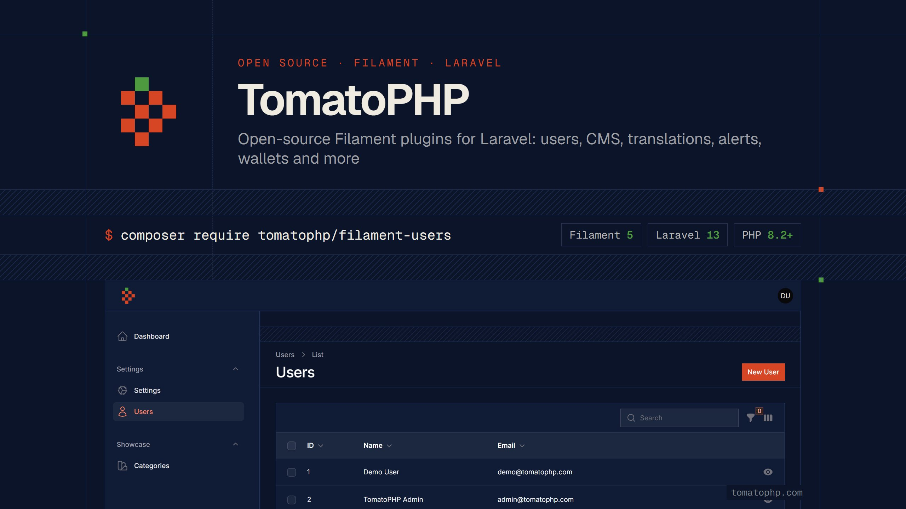

# TomatoPHP

Open-source plugins for [FilamentPHP](https://filamentphp.com) and Laravel: users, accounts, CMS, translations, alerts, wallets and more.
Every plugin is a plain Composer package you register on your panel, MIT licensed and maintained in the open.

- **Website:** [tomatophp.com](https://tomatophp.com)
- **Live demo:** [demo.tomatophp.com](https://demo.tomatophp.com): sign in with `demo@tomatophp.com` / `demo1234` (prefilled; data resets every hour)
- **Docs:** [tomatophp.com/en/docs](https://tomatophp.com/en/docs)
- **All plugins:** [tomatophp.com/en/plugins](https://tomatophp.com/en/plugins)
- **Support:** [Discord](https://discord.gg/vKV9U7gD3c)

## Filament 5

The plugins are moving to **Filament 5** on **Laravel 12 and 13**. These are released:

**Panel and users**

| Package | Version | |
|---|---|---|
| [filament-tomatophp-theme](https://github.com/tomatophp/filament-tomatophp-theme) | 5.0.1 | The TomatoPHP brand for your panel: mark, colors and screen-line styling |
| [filament-users](https://github.com/tomatophp/filament-users) | 5.0.3 | User resource with roles, teams, impersonation and password management |
| [filament-accounts](https://github.com/tomatophp/filament-accounts) | 5.0.0 | Multi accounts in one table with multi auth |
| [filament-saas-panel](https://github.com/tomatophp/filament-saas-panel) | 5.0.0 | Ready-to-use SaaS panel with teams, profile and API tokens |
| [filament-settings-hub](https://github.com/tomatophp/filament-settings-hub) | 5.0.1 | Manage your app settings from one hub |
| [filament-developer-gate](https://github.com/tomatophp/filament-developer-gate) | 5.0.0 | Protect developer-only pages behind a separate password |
| [filament-types](https://github.com/tomatophp/filament-types) | 5.0.1 | Manage any type in your app from the database |
| [filament-meta](https://github.com/tomatophp/filament-meta) | 5.0.0 | Pluggable meta for any model |
| [filament-icons](https://github.com/tomatophp/filament-icons) | 5.0.0 | Icon picker, table column and icons provider |
| [filament-locations](https://github.com/tomatophp/filament-locations) | 5.0.0 | Countries, cities, areas, languages and currencies |
| [filament-simple-theme](https://github.com/tomatophp/filament-simple-theme) | 5.0.0 | Sidebar-first layout with the user menu in the sidebar |
| [filament-api](https://github.com/tomatophp/filament-api) | 5.0.0 | Generate API endpoints from your Filament resources |
| [filament-helpers](https://github.com/tomatophp/filament-helpers) | 5.0.0 | Generators for forms, tables, actions and filters |
| [filament-pwa](https://github.com/tomatophp/filament-pwa) | 5.0.0 | Turn your panel into an installable PWA |
| [filament-seo](https://github.com/tomatophp/filament-seo) | 5.0.0 | SEO tags, analytics and Google indexing |
| [filament-logger](https://github.com/tomatophp/filament-logger) | 5.0.0 | Log activities and requests in your panel |
| [filament-social](https://github.com/tomatophp/filament-social) | 5.0.0 | Social login and share actions |
| [filament-tenancy](https://github.com/tomatophp/filament-tenancy) | 5.0.0 | Multi-database tenancy with a tenants resource |
| [filament-docs](https://github.com/tomatophp/filament-docs) | 5.0.0 | Document templates with variables and printing |
| [filament-artisan](https://github.com/tomatophp/filament-artisan) | 5.0.0 | Run Artisan commands from your panel (keep it behind a gate) |
| [filament-browser](https://github.com/tomatophp/filament-browser) | 5.0.0 | Browse and edit project files from your panel (keep it behind a gate) |
| [filament-workflows](https://github.com/tomatophp/filament-workflows) | 5.0.0 | Run actions on model events, custom events and webhooks |
| [filament-accounts-auth](https://github.com/tomatophp/filament-accounts-auth) | 5.0.0 | Login, register and 2FA pages for filament-accounts |
| [filament-bookmarks-menu](https://github.com/tomatophp/filament-bookmarks-menu) | 5.0.0 | Bookmark folders in your sidebar |
| [filament-fcm](https://github.com/tomatophp/filament-fcm) | 5.0.0 | Firebase push notifications for your panel users |

**Content**

| Package | Version | |
|---|---|---|
| [filament-cms](https://github.com/tomatophp/filament-cms) | 5.0.0 | Posts, categories and content for your site |
| [filament-cms-api](https://github.com/tomatophp/filament-cms-api) | 5.0.0 | Read-only API for published CMS content |
| [filament-cms-github](https://github.com/tomatophp/filament-cms-github) | 5.0.0 | Import repository READMEs as CMS docs |
| [filament-menus](https://github.com/tomatophp/filament-menus) | 5.0.0 | Database menus for your panel and site |
| [filament-media-manager](https://github.com/tomatophp/filament-media-manager) | 5.0.0 | Folders and files on top of Spatie Media Library |

**Translations**

| Package | Version | |
|---|---|---|
| [filament-translations](https://github.com/tomatophp/filament-translations) | 5.0.0 | Manage translations in the database with cache |
| [filament-translations-google](https://github.com/tomatophp/filament-translations-google) | 5.0.0 | Auto translate with Google Translate |
| [filament-translations-gpt](https://github.com/tomatophp/filament-translations-gpt) | 5.0.0 | Auto translate with OpenAI |
| [filament-translation-component](https://github.com/tomatophp/filament-translation-component) | 5.0.0 | Key/value translation field for every locale |
| [filament-language-switcher](https://github.com/tomatophp/filament-language-switcher) | 5.0.0 | Per-user language switcher |

**Notifications and money**

| Package | Version | |
|---|---|---|
| [filament-alerts](https://github.com/tomatophp/filament-alerts) | 5.0.0 | Notification templates sent over many channels |
| [filament-discord-driver](https://github.com/tomatophp/filament-discord-driver) | 5.0.0 | Discord webhook channel for alerts |
| [filament-fcm-driver](https://github.com/tomatophp/filament-fcm-driver) | 5.0.0 | Firebase Cloud Messaging channel for alerts |
| [filament-discord](https://github.com/tomatophp/filament-discord) | 5.0.0 | Send notifications and errors to Discord webhooks |
| [filament-twilio](https://github.com/tomatophp/filament-twilio) | 5.0.0 | Send WhatsApp notifications with Twilio |
| [filament-issues](https://github.com/tomatophp/filament-issues) | 5.0.0 | Show GitHub issues of your repos in your panel |
| [filament-form-builder](https://github.com/tomatophp/filament-form-builder) | 5.0.1 | Build forms and collect requests from the panel |
| [filament-wallet](https://github.com/tomatophp/filament-wallet) | 5.0.0 | Balances and wallets for your users |
| [filament-withdrawals](https://github.com/tomatophp/filament-withdrawals) | 5.0.1 | Withdrawal methods and requests |
| [filament-invoices](https://github.com/tomatophp/filament-invoices) | 5.0.0 | Invoices with items, payments and PDF |
| [filament-subscriptions](https://github.com/tomatophp/filament-subscriptions) | 5.0.0 | Plans, features and subscriptions with a billing page |
| [filament-payments](https://github.com/tomatophp/filament-payments) | 5.0.0 | Payment gateways and a checkout page (Stripe, PayPal, Paymob and more) |
| [filament-ecommerce](https://github.com/tomatophp/filament-ecommerce) | 5.0.0 | Products, orders, carts and coupons |
| [filament-notes](https://github.com/tomatophp/filament-notes) | 5.0.1 | Sticky notes for your panel users |
| [filament-pos](https://github.com/tomatophp/filament-pos) | 5.0.0 | Point of sale page on top of filament-ecommerce |
| [filament-plugins](https://github.com/tomatophp/filament-plugins) | 5.0.0 | Manage modules and generate tables, resources and pages |

The other plugins still have their Filament 3 and 4 releases on Packagist and are being upgraded one by one.

## For AI assistants

The TomatoPHP MCP server gives your AI assistant the plugin docs, the latest versions and which version fits your Filament and Laravel.

```bash
claude mcp add --transport http tomatophp https://mcp.tomatophp.com/mcp
```

```json
{ "mcpServers": { "tomatophp": { "type": "http", "url": "https://mcp.tomatophp.com/mcp" } } }
```

More at [mcp.tomatophp.com](https://mcp.tomatophp.com) · source: [tomatophp/mcp](https://github.com/tomatophp/mcp)

## Laravel packages

| Package | |
|---|---|
| [console-helpers](https://github.com/tomatophp/console-helpers) | Helpers for your Artisan commands |
| [laravel-package-generator](https://github.com/tomatophp/laravel-package-generator) | Generate a Laravel package with ease |
| [laravel-discord-error-tracker](https://github.com/tomatophp/laravel-discord-error-tracker) | Track your errors with a Discord webhook (2.x for Laravel 12/13) |
| [laravel-logstash](https://github.com/tomatophp/laravel-logstash) | Elastic Logstash integration (2.x for Laravel 12/13) |
| [laravel-agora](https://github.com/tomatophp/laravel-agora) | Agora token generator |

## Contributing

Issues and pull requests are welcome on every repository. Security reports: please use the security policy of the repository instead of a public issue.

## Credits

- [Fady Mondy](https://wa.me/+201207860084)
- [Abdelmjid](https://wa.me/201091523908)
